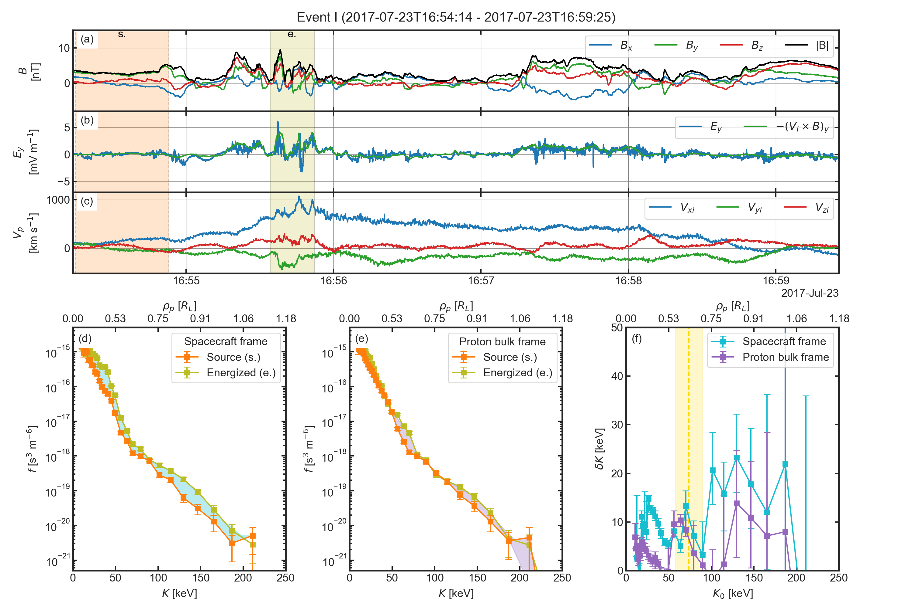
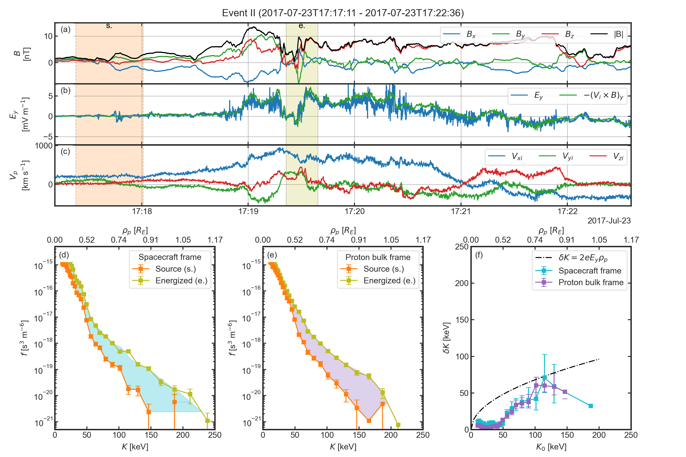

# Acceleration Mechanism

## Organisation
- [`acc_mechanism.py`](./acc_mechanism.py) contains the code to load 
  data and reproduce the Figure 6 and Figure 7. The data rates, levels and 
  figure parameters are stored in the [`./config/acc_mechnism.yml`](./config/acc_mechanism.yml) file.


## Datasets used
- The magnetic field measured by the Flux Gate Magnetometer (FGM) ([Russell et al. 2016](https://link.springer.com/article/10.1007/s11214-014-0057-3))
 
|              | Data rate | level |
|--------------|:---------:|------:|
| $`B`$ (GSE)  | srvy      | l2    |

- The electric field measured by the Electric field Double Probe (EDP) ([Ergun et al. 2016](https://link.springer.com/article/10.1007/s11214-014-0115-x),
  [Lindqvist et al. 2016](https://link.springer.com/article/10.1007/s11214-014-0116-9))
 
|              | Data rate | level |
|--------------|:---------:|------:|
| $`E`$ (GSM)  | fast      | l2    |

- The thermal ion (proton) moments are computed using the partial moments 
  of the velocity distribution functions measured by the Fast Plasma 
  Investigation (FPI) ([Pollock et al. 2016](https://link.springer.com/article/10.1007/s11214-016-0245-4)) removing the background low-energy noise for ions and photoelectrons.

|                | Data rate | level | Split Energy Level |
|----------------|:---------:|:------|-------------------:|
| $`V_i`$ (GSM)  | fast      | l2    |        19          |

> **_NOTE:_** The spintone in removed from the bulk velocity

- The ion (protons and alphas) moments are measured by the Hot Plasma 
  Composition Analyser (HPCA) ([Young et al. 2016](https://link.springer.com/article/10.1007/s11214-014-0119-6)).

|                      | Data rate | level |
|----------------------|:---------:|:------|
| $`V_{H^{+}}`$ (GSM)  | fast      | l2    |

- The omnidirectional energetic ion (protons and helium ions) and electron 
  differential particle flux energy spectrum are measured by the Energetic 
  Ion Spectrometer (EIS) ([Mauk et al. 2016](https://link.springer.com/article/10.1007/s11214-014-0055-5)).

|                    | Data rate | level |
|--------------------|:---------:|------:|
| Proton Diff. Flux  | srvy      | l2    |

> **_NOTE_** The omni-directional spectra are spin averaged.


## Reproducibility
```bash
python3.9 acc_mechanism.py --config ./config/acc_mechanism.yml --t-id 0
```

[](../figures/figure_6.png)

```bash
python3.9 acc_mechanism.py --config ./config/acc_mechanism.yml --t-id 1
```

[](../figures/figure_7.png)


