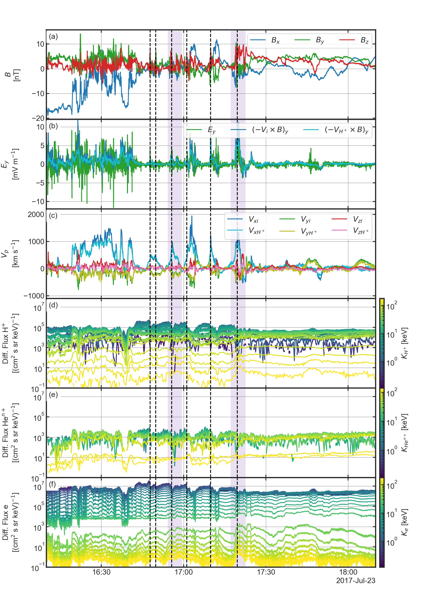
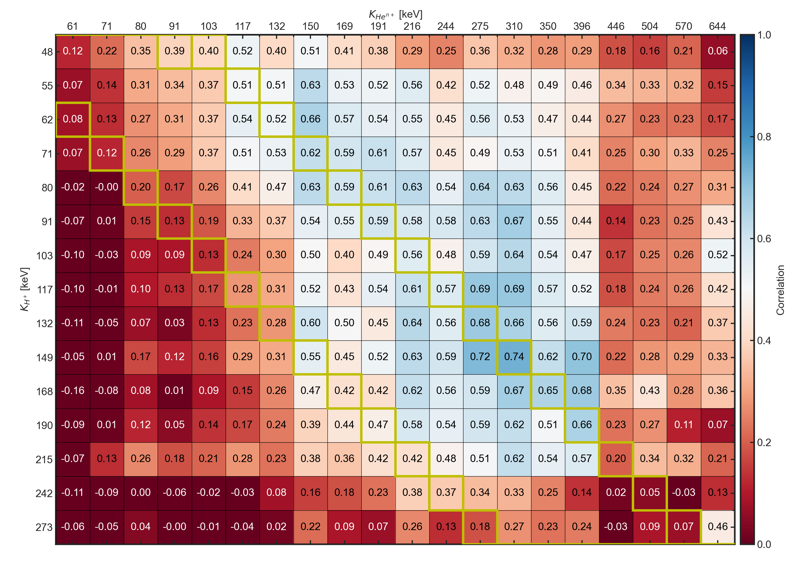
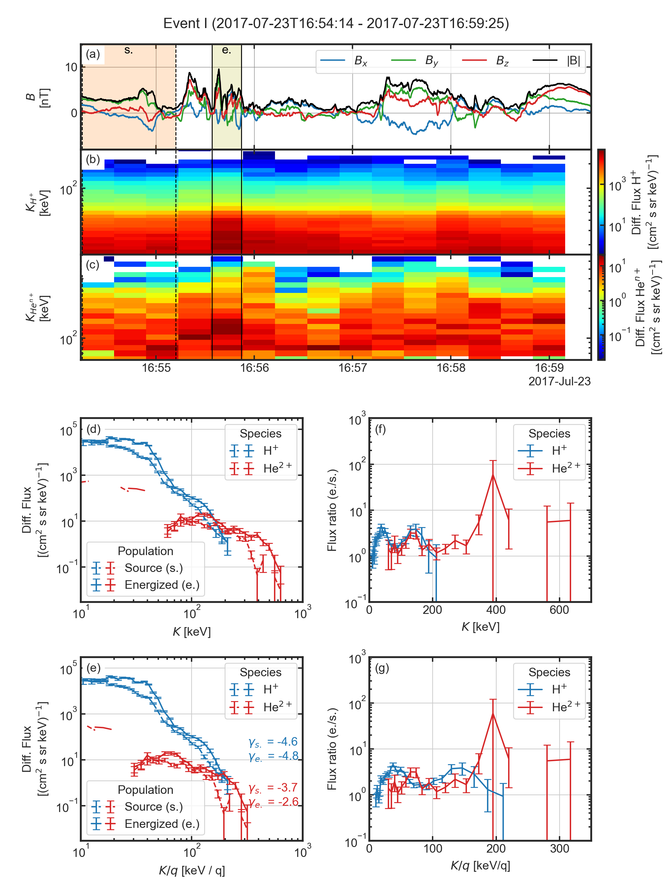
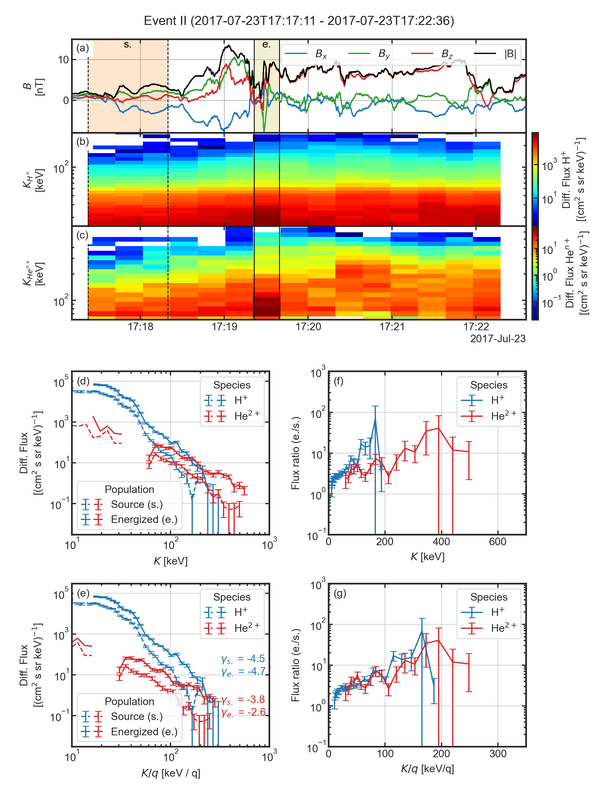

# Ion Composition

## Organisation
- [`ion_flux_tseries.py`](./ion_flux_tseries.py) contains the code to load 
  data and reproduce the Figure 2. The data rates, levels and figure 
  parameters are stored in the [`./config/ion_flux_tseries.yml`](./config/ion_flux_tseries.yml) file.
- [`ion_correlation.py`](./ion_correlation.py) contains the code to load 
  data and reproduce the Figure 3. The data rates, levels and figure 
  parameters are stored in the [`./config/ion_correlation.yml`](./config/ion_correlation.yml) file.
- [`ion_energization.py`](./ion_energization.py) contains the code to load 
  data and reproduce the Figure 4 and Figure 5. The data rates, levels and 
  figure parameters are stored in the [`./config/ion_energization.yml`](./config/ion_energization.yml) file.


## Datasets used
- The magnetic field measured by the Flux Gate Magnetometer (FGM) ([Russell et al. 2016](https://link.springer.com/article/10.1007/s11214-014-0057-3))
 
|              | Data rate | level |
|--------------|:---------:|------:|
| $`B`$ (GSE)  | srvy      | l2    |

- The electric field measured by the Electric field Double Probe (EDP) ([Ergun et al. 2016](https://link.springer.com/article/10.1007/s11214-014-0115-x),
  [Lindqvist et al. 2016](https://link.springer.com/article/10.1007/s11214-014-0116-9))
 
|              | Data rate | level |
|--------------|:---------:|------:|
| $`E`$ (GSM)  | fast      | l2    |

- The thermal ion (proton) moments are computed using the partial moments 
  of the velocity distribution functions measured by the Fast Plasma 
  Investigation (FPI) ([Pollock et al. 2016](https://link.springer.com/article/10.1007/s11214-016-0245-4)) removing the background low-energy noise for ions and photoelectrons.

|                | Data rate | level | Split Energy Level |
|----------------|:---------:|:------|-------------------:|
| $`V_i`$ (GSM)  | fast      | l2    |        19          |

> **_NOTE:_** The spintone in removed from the bulk velocity

- The omnidirectional ion and electron differential particle flux energy 
  spectrum are computed from the 3D skymap velocity distribution 
  functions (VDF) measured by the Fast Plasma Investigation (FPI) ([Pollock et al. 2016](https://link.springer.com/article/10.1007/s11214-016-0245-4)).

|              | Data rate | level |
|--------------|:---------:|------:|
| Ion VDF      | fast      | l2    |
| Electron VDF | fast      | l2    |

- The ion (protons and alphas) moments are measured by the Hot Plasma 
  Composition Analyser (HPCA) ([Young et al. 2016](https://link.springer.com/article/10.1007/s11214-014-0119-6)).

|                       | Data rate | level |
|-----------------------|:---------:|:------|
| $`V_{H^{+}}`$ (GSM)   | fast      | l2    |

- The omnidirectional proton and alphas differential particle flux energy 
  spectrum are computed from the 3D spin based skymap velocity distribution 
  functions (VDF) measured by the Hot Plasma 
  Composition Analyser (HPCA) ([Young et al. 2016](https://link.springer.com/article/10.1007/s11214-014-0119-6)).

|              | Data rate | level |
|--------------|:---------:|------:|
| Proton VDF   | srvy      | l2    |
| Alphas VDF   | srvy      | l2    |

- The omnidirectional energetic ion (protons and helium ions) and electron 
  differential particle flux energy spectrum are measured by the Energetic 
  Ion Spectrometer (EIS) ([Mauk et al. 2016](https://link.springer.com/article/10.1007/s11214-014-0055-5)).

|                      | Data rate | level |
|----------------------|:---------:|------:|
| Proton Diff. Flux    | srvy/brst | l2    |
| Alphas Diff. Flux    | srvy/brst | l2    |
| Electron Diff. Flux  | srvy/brst | l2    |

> **_NOTE_** The omni-directional spectra are spin averaged.


## Reproducibility
```bash
python3.9 ion_flux_tseries.py --config ./config/ion_flux_tseries.yml
```

[](../figures/figure_2.png)

```bash
python3.9 ion_correlation.py --config ./config/ion_correlation.yml
```

[](../figures/figure_3.png)

```bash
python3.9 ion_energization.py --config ./config/ion_energization.yml --t-id 0
```

[](../figures/figure_4.png)

```bash
python3.9 ion_energization.py --config ./config/ion_energization.yml --t-id 1
```

[](../figures/figure_5.png)


