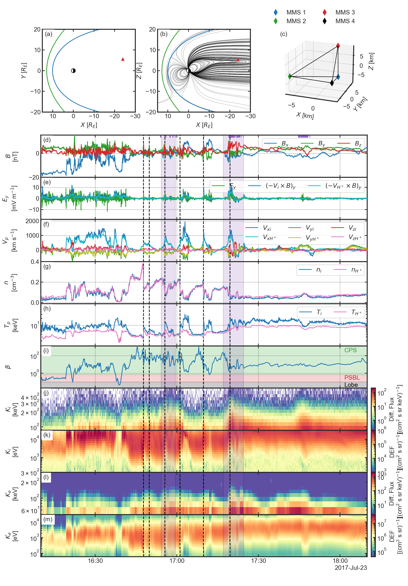

# Overview

## Organisation
- [`overview.py`](./overview.py) contains the code to load data and 
  reproduce the Figure 1. The data rates, levels and figure parameters are 
  stored in the [`./config/overview.yml`](/config/overview.yml) file.   


## Datasets used
- The T89 Earth magnetic field model is computed the solar wind measurement 
  from the ([OMNI web](https://omniweb.gsfc.nasa.gov/))

- The magnetic field measured by the Flux Gate Magnetometer (FGM) ([Russell et al. 2016](https://link.springer.com/article/10.1007/s11214-014-0057-3))
 
|              | Data rate | level |
|--------------|:---------:|------:|
| $`B`$ (GSE)  | srvy      | l2    |

- The electric field measured by the Electric field Double Probe (EDP) ([Ergun et al. 2016](https://link.springer.com/article/10.1007/s11214-014-0115-x),
  [Lindqvist et al. 2016](https://link.springer.com/article/10.1007/s11214-014-0116-9))
 
|              | Data rate | level |
|--------------|:---------:|------:|
| $`E`$ (GSM)  | fast      | l2    |

- The thermal ion (proton) moments are computed using the partial moments 
  of the velocity distribution functions measured by the Fast Plasma 
  Investigation (FPI) ([Pollock et al. 2016](https://link.springer.com/article/10.1007/s11214-016-0245-4)) removing the background low-energy noise for ions and photoelectrons.

|                | Data rate | level | Split Energy Level |
|----------------|:---------:|:------|-------------------:|
| $`n_i`$        | fast      | l2    |        19          |
| $`V_i`$ (GSM)  | fast      | l2    |        19          |
| $`T_i`$ (GSM)  | fast      | l2    |        19          |

> **_NOTE:_** The spintone in removed from the bulk velocity

- The omnidirectional ion and electron differential energy flux energy 
  spectrum are computed from the 3D skymap velocity distribution 
  functions (VDF) measured by the Fast Plasma Investigation (FPI) ([Pollock et al. 2016](https://link.springer.com/article/10.1007/s11214-016-0245-4)).

|              | Data rate | level |
|--------------|:---------:|------:|
| Ion VDF      | fast      | l2    |
| Electron VDF | fast      | l2    |

- The ion (protons and alphas) moments are measured by the Hot Plasma 
  Composition Analyser (HPCA) ([Young et al. 2016](https://link.springer.com/article/10.1007/s11214-014-0119-6)).

|                       | Data rate | level |
|-----------------------|:---------:|:------|
| $`n_{H^{+}}`$         | fast      | l2    |
| $`V_{H^{+}}`$ (GSM)   | fast      | l2    |
| $`T_{H^{+}}`$ (GSM)   | fast      | l2    |
| $`n_{He^{+}}`$        | fast      | l2    |

- The omnidirectional energetic ion and electron energy spectrum are 
  measured by the Fly Eye Energetic Particle Spectrometer (FEEPS) ([Blake 
  et al. 2016](https://link.springer.com/article/10.1007/s11214-015-0163-x)).

|                      | Data rate | level |
|----------------------|:---------:|------:|
| Ion Diff. Flux       | srvy      | l2    |
| Electron Diff. Flux  | srvy      | l2    |

> **_NOTE_** The energy table in FEEPS spectra is modified and the fluxes 
> are corrected using a flat field correction according to FEEPS calibration 
> report D. Turner 1/19/2017. Removes sunlight contamination based on 
> calibration tables.


## Reproducibility
```bash
python3.9 overview.py --config ./config/overview.yml
```

[](../figures/figure_1.png)


